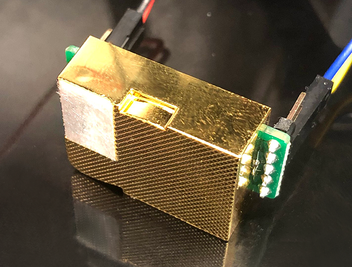
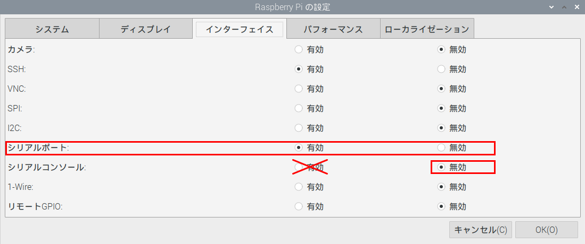
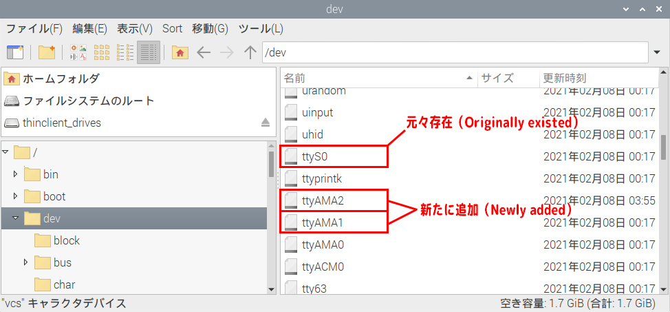

<p align="center">
  
</p>

## 概要（Overview）

このプラグインはhomebridgeを通して[MH-Z19](https://www.winsen-sensor.com/d/files/infrared-gas-sensor/mh-z19c-pins-type-co2-manual-ver1_0.pdf)での二酸化炭素濃度計測結果をHomeKit上に表示する為のプラグインです。（This plug-in is a plug-in for displaying the carbon dioxide concentration measurement result of [MH-Z19](https://www.winsen-sensor.com/d/files/infrared-gas-sensor/mh-z19c-pins-type-co2-manual-ver1_0.pdf) on HomeKit through homebridge.）

### テスト環境（Testing Environment）

* Raspberry Pi 4 modelB 4GB（UART1、UART2、UART4）
* Winsen MH-Z19C

ここに書いてある事はわたしが設定した内容であり、動作を保証するものではありません。（What is written here is what I have set, and I do not guarantee the operation.）
もしかしたら他の環境でも動くかもしれません。

### 配線図 (Wiring diagram)


### 設定 （Configuration）

#### ① シリアルポートの有効化 （Enable serial port）



メニューの『設定＞Raspberry Pi の設定＞インターフェイス』のシリアルポートを有効にします。（SerialPort ⇒ enable）

この際、シリアルコンソールは無効のままにしてください。（Serial console ⇒ Disable）

再起動を促されるので再起動します。（You will be prompted to reboot, so reboot.）

#### ② UART2,UART4を使用する場合 （When using UART2 and UART4）

`/boot/config.txt` を編集します。（Edit）

例えば（For example）、 `sudo nano /boot/config.txt`

```
・・・・

[all]

・・・・

dtoverlay=uart2
dtoverlay=uart4

```

一番最後に上記の２行を追加します。（Add the above two lines at the very end.）

UART4を使用しない場合は、UART2の行だけを追加します。（If you are not using UART4, add only the UART2 line.）

保存したら再起動します。（After saving, reboot.）

再起動が完了したら `/dev` を確認してください。（Check `/dev` when the reboot is complete.）

下記の項目が追加されていたらUART2,UART4の解放は成功です。（Release of UART2 and UART4 is successful if the following items exist.）



#### ③ RaspberryPiを再起動する度に必要な作業 （Work required every time you restart the Raspberry Pi）

* 起動時にserial-gettyがシリアルポートを占有してしまう為、STOPする。（Stop because serial-getty occupies the serial port at startup.）
* プログラムが`sudo`無しにシリアルポートにアクセスできるようにパーミッションを変更します。再起動する度に元に戻ります。（Change the permissions so that the program can access the serial port without `sudo`. It will be restored every time you restart.）

具体的には、

UART1の場合、
```
sudo systemctl stop serial-getty@ttyS0.service
sudo chmod 666 /dev/ttyS0
```

UART2の場合、
```
sudo systemctl stop serial-getty@ttyAMA1.service
sudo chmod 666 /dev/ttyAMA1
```

UART4の場合、
```
sudo systemctl stop serial-getty@ttyAMA2.service
sudo chmod 666 /dev/ttyAMA2
```

UART2,UART4は開放状況、環境によってずれる可能性があります。（UART2 and UART4 may shift depending on the open status and environment.）
